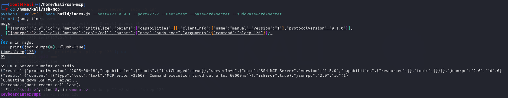

## VULN-002 — Sudo Password Exposed in Remote Server Process List

## INFO

**CWE:** CWE-522 (Insufficiently Protected Credentials)

The `sudoPassword` is embedded directly into the command string sent to the remote SSH server via `conn.exec()`. Since SSH's exec request goes through `/bin/sh -c` on the remote server, the sudo password appears in the remote process's command line.

**Location:** `src/index.ts:478-481`

**Vulnerable Code:**
```typescript
const pwdEscaped = sudoPassword.replace(/'/g, "'\\''");
wrapped = `printf '%s\\n' '${pwdEscaped}' | sudo -p "" -S sh -c '${commandWithDescription.replace(/'/g, "'\\''")}'`;
return await execSshCommandWithConnection(connectionManager, wrapped);
```

**Attack Scenario:**

1. User configures ssh-mcp with `--sudoPassword=MySudoPass123`
2. MCP client invokes `sudo-exec` with any command
3. The following string is sent to the remote server's shell:
   ```
   printf '%s\n' 'MySudoPass123' | sudo -p "" -S sh -c 'ls'
   ```
4. Any user on the **remote** server can now read the sudo password:
   ```bash
   # On the remote server:
   ps aux | grep printf
   # Shows: printf '%s\n' 'MySudoPass123' | sudo -p "" -S sh -c 'ls'
   
   cat /proc/$(pgrep -f "printf.*sudo")/cmdline | tr '\0' ' '
   # Shows the full command including the plaintext password
   ```

**Impact:**
- Sudo password leaked to any user on the remote server
- Process accounting (`lastcomm`, `acct`, `auditd`) may log the password
- Password persists in logs and audit trails
- Combined with VULN-001, both local and remote credentials are exposed

**Fix:** Use SSH channel stdin to pipe the password instead of embedding it in the command:
```typescript
conn.exec(`sudo -p "" -S sh -c '${commandWithDescription.replace(/'/g, "'\\''")}'`, (err, stream) => {
  stream.write(sudoPassword + '\n');
  stream.end();
  // ... read output
});
```

## Valid

Terminal A: Start `ssh-mcp` and initiate `sudo-exec` to keep the remote command running, leaving time for Terminal B to capture the command line of the remote process.

Terminal B: Clear the `sudo` cache and enumerate remote-related processes to check if the plaintext `sudoPassword` appears in the command line.

Start `ssh-mcp` and make the remote end continuously execute `sleep 120`:

```shell
cd /home/kali/ssh-mcp
python3 - <<'PY' | node build/index.js --host=127.0.0.1 --port=2222 --user=test --password=secret --sudoPassword=secret
import json, time
msgs = [
  {"jsonrpc":"2.0","id":0,"method":"initialize","params":{"capabilities":{},"clientInfo":{"name":"manual","version":"1"},"protocolVersion":"0.1.0"}},
  {"jsonrpc":"2.0","id":1,"method":"tools/call","params":{"name":"sudo-exec","arguments":{"command":"sleep 120"}}},
]
for m in msgs:
    print(json.dumps(m), flush=True)
time.sleep(120)
PY
```



Check the relevant processes on the remote machine:
```shell
ssh -p 2222 test@127.0.0.1 'sudo -k'
sleep 1
pgrep -fa 'printf|sudo -p|sleep 120'
for pid in $(pgrep -f 'printf|sudo -p|sleep 120'); do
  echo "=== PID $pid ==="
  cat /proc/$pid/cmdline | tr '\0' ' '
  echo
done
ps -efww | grep -E 'printf|sudo -p|sleep 120' | grep -v grep
```


Observe that：

```text
bash -c printf '%s\n' 'secret' | sudo -p "" -S sh -c 'sleep 120'
```

At the same time, the same content can also be read from `/proc/<pid>/cmdline`. The key point is not just seeing `sleep 120`, but clearly seeing the plaintext `secret` in the remote command line.


`sudoPassword` is concatenated into the remote shell command string, and the remote local user(**low privilege**) can read the plaintext password through `ps` or `/proc/<<pid>/cmdline`.